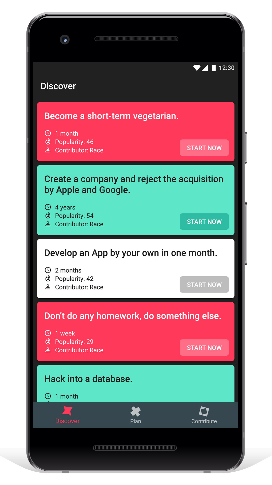
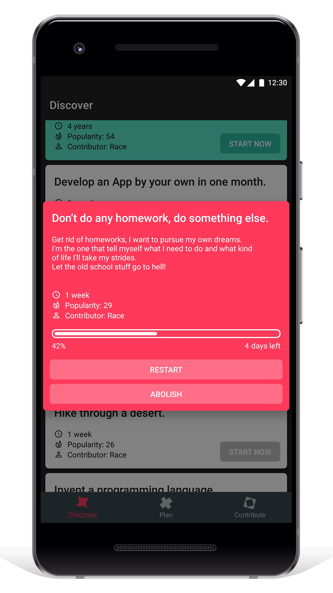
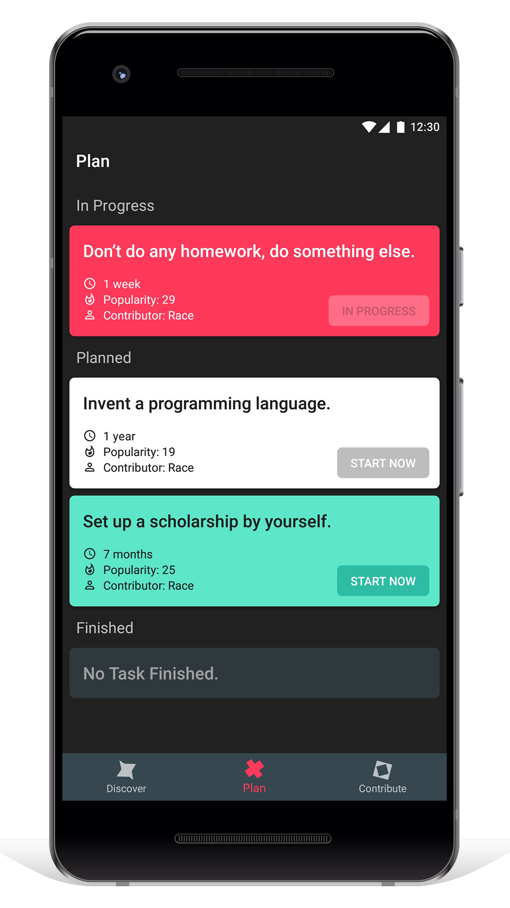
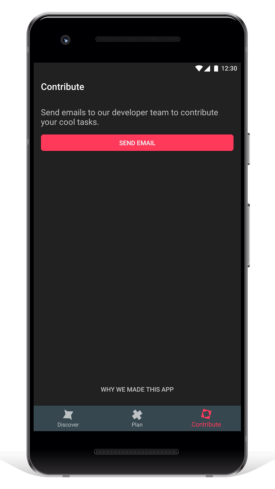

# Mediocre Plan

*Break Boredom and be COOL!*


Mediocre Plan is an app that allows you to discover cool tasks and be cool. This was an idea from my friend [Race](http://js.zjol.com.cn/ycxw_zxtf/201807/t20180716_7792033.shtml). In today's age, being cool is not so cool. We believe it the right way to break boredom to think about the future and start mediocre plans. 

Mediocre Plan (Android) is another showcase of Android development with [Kotlin](https://kotlinlang.org/) and MVVM architecture. It is a quite simple app, and hopefully the UI would let you feel tactile and understandable. 

- **[Install on Google Play](https://play.google.com/store/apps/details?id=com.race.mediocreplan)**
- **[Install on App Store](https://itunes.apple.com/us/app/mediocre-plan/id1434035659)**

## Screenshots






## License

```
Copyright 2018 Alex Fan

Licensed under the Apache License, Version 2.0 (the "License");
you may not use this file except in compliance with the License.
You may obtain a copy of the License at

    http://www.apache.org/licenses/LICENSE-2.0

Unless required by applicable law or agreed to in writing, software
distributed under the License is distributed on an "AS IS" BASIS,
WITHOUT WARRANTIES OR CONDITIONS OF ANY KIND, either express or implied.
See the License for the specific language governing permissions and
limitations under the License.
```